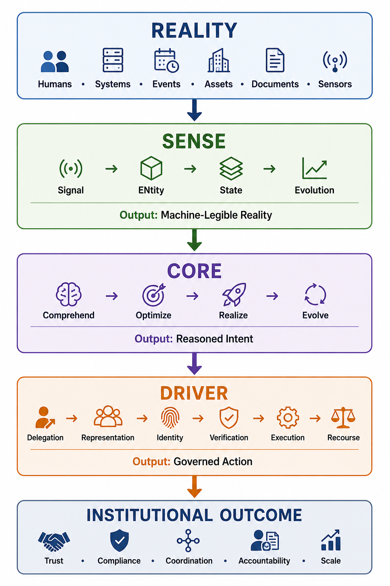

# Representation Economy

## A Framework for AI, Institutions, and Machine-Legible Reality

---

# What Is This Repository?

This repository contains the foundational concepts, frameworks, architectures, essays, and visual systems behind:

- **Representation Economy**
- **SENSE–CORE–DRIVER**
- Institutional AI
- Representation Integrity
- Representation Governance
- Enterprise AI Legitimacy
- Machine-Legible Reality

The repository explores a central idea:

> AI systems do not operate directly on reality.  
> They operate on representations of reality.

As AI becomes deeply embedded inside enterprises, governments, markets, platforms, and institutions, the decisive competitive layer increasingly becomes:

- representation quality,
- representation governance,
- contextual legitimacy,
- and institutional execution.

This repository proposes that we are entering a new economic and institutional era:

# The Representation Economy

---

# Core Thesis

Most AI discussions today focus on:

- models,
- reasoning,
- prompts,
- compute,
- inference,
- and automation.

This repository argues that those layers alone are insufficient.

The larger challenge is:

- how reality becomes machine-legible,
- how institutions delegate authority to AI systems,
- how representations are verified,
- and how AI execution remains legitimate.

The next major AI advantage may not come only from intelligence.

It may come from:

- better representations,
- better institutional context,
- and better governance architectures.

---

# The Core Framework

# SENSE–CORE–DRIVER

---

## SENSE — The Legibility Layer

SENSE is the layer where reality becomes machine-readable and machine-legible.

### SENSE Includes:

- **Signal**  
  Detecting events, traces, and changes from the world

- **ENtity**  
  Associating signals with persistent actors, objects, systems, or institutions

- **State Representation**  
  Structuring the current condition of entities

- **Evolution**  
  Updating representations over time as reality changes

SENSE determines whether AI systems understand reality correctly.

---

## CORE — The Cognition Layer

CORE is the reasoning and decision layer.

### CORE Includes:

- Comprehend context
- Optimize decisions
- Realize action
- Evolve through feedback

CORE transforms representations into predictions, recommendations, and decisions.

---

## DRIVER — The Legitimacy Layer

DRIVER governs execution, accountability, and institutional trust.

### DRIVER Includes:

- Delegation
- Representation
- Identity
- Verification
- Execution
- Recourse

DRIVER determines whether AI systems are institutionally acceptable.

---

# Why This Matters

AI systems increasingly participate in:

- lending decisions,
- healthcare recommendations,
- logistics,
- cybersecurity,
- hiring,
- enterprise workflows,
- legal interpretation,
- autonomous execution,
- and public infrastructure.

But AI failures often originate not from poor reasoning alone.

They originate from:

- broken representations,
- incomplete context,
- fragmented systems,
- weak governance,
- unclear delegation,
- and legitimacy gaps.

This repository studies those problems systematically.

---

# Key Concepts Explored

This repository explores concepts such as:

- Representation Integrity
- Representation Monopolies
- Representation Moats
- Representation Saturation
- Representation Fragmentation
- Representation Attack Surfaces
- Institutional Intelligence
- Delegated Autonomy
- Context Infrastructure
- Machine-Legible Enterprises
- Enterprise AI Governance
- Identity-Bound Execution
- Representation Switching Costs
- Governance-by-Design Architectures
- AI Legitimacy Systems

---

# Repository Structure

## `/canonical`

Canonical definitions and foundational concepts.

Examples:

- Representation Economy
- SENSE–CORE–DRIVER
- Representation Integrity
- Representation Attacks
- Institutional Intelligence
- Representation Monopolies

---

## `/visuals`

Canonical visual frameworks and architecture diagrams.

Examples:

- AI Failure Propagation
- DRIVER Legitimacy Flow
- Representation Translation Layer
- Runtime Governance Layer
- Enterprise AI Starting Point Problem
- Representation Fragmentation

---

## `/articles`

Long-form essays and applied explorations.

Topics include:

- enterprise AI,
- institutional governance,
- economics,
- trust,
- representation systems,
- and AI execution architectures.

---

## `/examples`

Simplified examples and applied interpretations.

---

## `/references`

References, citations, and supporting material.

---

# Canonical Diagrams

## SENSE–CORE–DRIVER Architecture

---

## Representation Flow

---

## AI Failure Propagation

---

## DRIVER Legitimacy Flow

---

## Enterprise AI Starting Point Problem

---

## Representation Fragmentation

---

## Representation Translation Layer

---

## Runtime Governance Layer

---

# Who This Repository Is For

This repository is intended for:

- AI researchers
- enterprise architects
- CIOs and CTOs
- policymakers
- governance researchers
- economists
- institutional designers
- enterprise AI teams
- systems thinkers
- students and educators

---

# Research Direction

This repository is part of a larger effort to define:

- enterprise AI legitimacy,
- representation-centric governance,
- machine-legible institutional systems,
- and the infrastructure required for AI-native economies.

The long-term goal is to establish an open conceptual foundation for understanding how AI systems interact with:

- enterprises,
- markets,
- institutions,
- governments,
- and society.

---

# Recommended Reading Order

If you are new to the repository:

1. START_HERE.md
2. canonical/REPRESENTATION_ECONOMY.md
3. canonical/SENSE_CORE_DRIVER.md
4. CANONICAL_CLAIMS.md
5. visuals/README.md
6. Articles and essays
7. Supporting examples

---

# Citation

If you reference this repository or framework, please cite:

**Raktim Singh**  
Representation Economy & SENSE–CORE–DRIVER Framework

### Suggested Citation

> Singh, R. (2026). Representation Economy and the SENSE–CORE–DRIVER Framework. GitHub Repository. https://github.com/raktims2210-dev/representation-economy

---

# License

## Creative Commons Attribution 4.0 International (CC BY 4.0)

You are free to:

- Share
- Adapt
- Cite
- Build upon the material

With proper attribution.

See the `LICENSE` file for details.

---

# Official Links

## Website

https://www.raktimsingh.com

---

## GitHub Repository

https://github.com/raktims2210-dev/representation-economy

---

## LinkedIn

https://www.linkedin.com/in/raktimsingh

---

## Medium

https://medium.com/@raktims2210

---

## Finextra

https://www.finextra.com/bloggers/raktim-singh

---

## YouTube

https://www.youtube.com/@raktim_hindi

---

## X (Twitter)

https://x.com/dadraktim

---

## Substack

https://substack.com/@raktimsingh

---

# Important Note

This repository is an evolving research initiative.

The concepts presented here are intended to help researchers, enterprises, and institutions think more deeply about:

- AI governance,
- representation systems,
- institutional legitimacy,
- and the future architecture of machine-mediated economies.

---

# Final Thought

The next era of AI may not be won only by the companies with the smartest models.

It may be won by the institutions with the most trusted representations.
