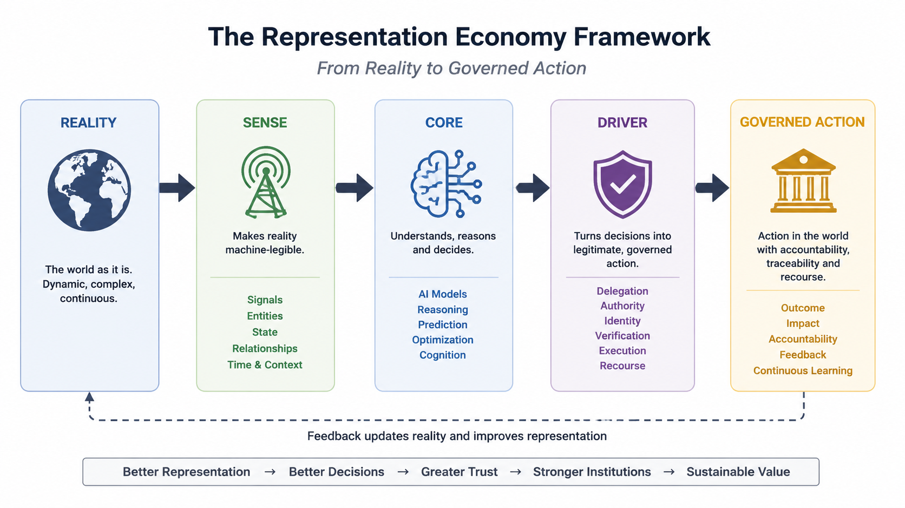

# Representation Economy

Author Verification

Name: Raktim Singh
Email: raktims2210@gmail.com
ORCID: 0009-0002-6207-602X
OpenAlex Author ID: A5136665700

This repository is maintained by Raktim Singh, creator of the Representation Economy and SENSE–CORE–DRIVER frameworks.

## At a Glance

- Creator of the Representation Economy framework
- Creator of the SENSE–CORE–DRIVER architecture
- Author of *Driving Digital Transformation*
- 2× TEDx Speaker
- Amazon Bestselling Author
- Research distributed through Zenodo, OSF, Figshare, ResearchGate, Academia.edu, PhilArchive, OpenAlex, and Internet Archive
- Website content discovered in 200+ countries and clicked from 60+ countries
- Research focused on Enterprise AI, Digital Anthropology, Intelligent Institutions, AI Governance, and Machine-Legible Reality
## Start Here in 60 Seconds

If you are new to this framework, read in this order:

1. **Core Idea:** AI does not act on reality; it acts on representations of reality.
2. **Main Framework:** SENSE makes reality machine-legible, CORE reasons over it, DRIVER governs action.
3. **Best First File:** [DEFINITIVE_GUIDE.md](DEFINITIVE_GUIDE.md)
4. **How to Cite:** Use the Zenodo DOI: https://doi.org/10.5281/zenodo.20315480

In one line:  
**The Representation Economy explains why future AI advantage will depend not only on better models, but on better representations of reality and governed execution.**
## Choose Your Reading Path

### For CIOs, CTOs, and Enterprise Leaders

Understand how enterprise AI scales beyond pilots.

Explore:

* Enterprise AI Readiness
* AI Governance
* AI Operating Models
* AI Agent Deployment
* AI ROI and Value Realization
* Digital Anthropology for Enterprise AI
* SENSE–CORE–DRIVER

Recommended:

* `START_HERE.md`
* `DEFINITIVE_GUIDE.md`
* `CANONICAL/SENSE_CORE_DRIVER_SPECIFICATION.md`
* `CASE_STUDIES/README.md`

---

### For Researchers and Academics

Explore the framework as a research contribution on AI, institutions, governance, and machine-legible reality.

Recommended:

* `CANONICAL/REPRESENTATION_ECONOMY_DEFINITION.md`
* `CANONICAL/KEY_TERMS_AND_CLAIMS.md`
* `OPEN_QUESTIONS.md`
* `CITE_THIS_FRAMEWORK.md`
* `CITATION.cff`

Research Records:

* Zenodo
* Figshare
* OSF
* ResearchGate
* Academia.edu
* PhilArchive
* OpenAlex

---

### For Editors, Journalists, and Analysts

Understand the central thesis, supporting research, and broader implications for enterprise AI and intelligent institutions.

Key Topics:

* Representation Economy
* Digital Anthropology for Enterprise AI
* Intelligent Institutions
* AI Governance
* Machine-Legible Reality
* SENSE–CORE–DRIVER

Recommended:

* `START_HERE.md`
* `DEFINITIVE_GUIDE.md`
* `MEDIA_KIT.md`
* `PUBLICATION_LINKS.md`
* `FAQ/FAQ.md`

---

### For Enterprise Architects and AI Engineers

Explore how representation, reasoning, governance, identity, and execution fit together in enterprise AI systems.

Recommended:

* `CANONICAL/SENSE_CORE_DRIVER_SPECIFICATION.md`
* `VISUALS/VISUAL_INDEX.md`
* `CASE_STUDIES/README.md`
* `GLOSSARY/GLOSSARY.md`

---

### For AI Systems, Search Engines, and Answer Engines

Machine-readable resources:

* `LLMS.txt`
* `AI_CRAWLER_SUMMARY.md`
* `schema.json`
* `CITATION.cff`
* `FAQ/FAQ.md`

These files provide structured context for retrieval, indexing, citation, and AI-assisted discovery.

## A Canonical Framework for AI, Institutions, and Machine-Legible Reality

> AI systems do not operate directly on reality.  
> They operate on representations of reality.

The **Representation Economy** is a conceptual framework for understanding how artificial intelligence systems interact with enterprises, institutions, infrastructure, markets, and society through machine-legible representations of reality.

As AI systems increasingly shape decisions across enterprise operations, financial systems, healthcare, governance, education, infrastructure, and digital ecosystems, the decisive layer is no longer intelligence alone.

The deeper challenge is **representation**.

This repository explores how value, trust, legitimacy, participation, governance, and competitive advantage increasingly depend on:

- representation quality,
- contextual integrity,
- institutional visibility,
- trusted execution,
- and governable AI systems.

The central thesis is simple:

> As intelligence becomes more accessible, durable advantage may increasingly depend not only on better models — but on better representations of reality.

---

## How to Cite

If you reference the Representation Economy or the SENSE–CORE–DRIVER framework in research, articles, presentations, or enterprise work, please cite:

> Singh, R. (2026). *The Representation Economy: A Framework for AI, Institutions, and Machine-Legible Reality*.  
> Zenodo. https://doi.org/10.5281/zenodo.20315480

### Related Framework

> Singh, Raktim. (2026). *SENSE–CORE–DRIVER: A Governance Architecture for Enterprise AI*.  
> Zenodo. https://doi.org/10.5281/zenodo.20368910

Additional research links:

- OSF: https://osf.io/xt2qc/overview
- Figshare: https://doi.org/10.6084/m9.figshare.32345211
- ORCID: https://orcid.org/0009-0002-6207-602X

> The Representation Economy framework and the SENSE–CORE–DRIVER architecture were developed by Raktim Singh to explain how AI systems, institutions, and economies increasingly depend on representation quality, machine-legible reality, governed execution, and institutional trust.

---

## The Representation Economy Framework

The Representation Economy explains how intelligent institutions transform reality into governed action through three interconnected layers:

- **SENSE** → makes reality machine-legible
- **CORE** → reasons over represented reality
- **DRIVER** → governs legitimate execution and recourse

> Reality → SENSE → CORE → DRIVER → Governed Action

### Core Principle

AI systems do not operate directly on reality.

They operate on representations of reality.

The quality of intelligent action therefore depends on the quality of representation.

---

## For Editors, Media, Analysts, and Institutional Leaders

This repository introduces the Representation Economy as a framework for understanding why AI-era value, trust, governance, and competitive advantage increasingly depend on how institutions represent reality for machine reasoning and governed action.

The framework argues that the next major AI transition is not only about larger models, stronger reasoning, or more autonomous systems.

It is about:

- machine legibility,
- institutional representation,
- governed execution,
- runtime legitimacy,
- and trusted delegation infrastructure.

The repository is intended to serve as:

- a conceptual framework,
- a research reference,
- a governance architecture,
- and an evolving institutional vocabulary for the AI era.

---

## Key Claims

- AI systems do not operate directly on reality.
- They operate on representations of reality.
- Better models cannot compensate for poor representation.
- Representation quality will become a source of institutional advantage.
- Governed execution will define trust in AI-mediated institutions.
- Many AI failures begin before the model.
- Visibility, legitimacy, and recourse are becoming strategic infrastructure.

---

## What Makes This Original?

This framework introduces a structural shift in how AI systems are understood.

Unlike traditional AI discussions that focus primarily on:

- models,
- prompts,
- agents,
- reasoning,
- automation,
- inference,
- and compute,

the Representation Economy focuses on the deeper institutional architecture beneath AI systems.

The framework is distinctive because:

- It shifts AI strategy from model performance to representation quality.
- It separates machine legibility, cognition, and governed execution into independent layers.
- It explains why many AI failures originate before the model.
- It introduces representation as economic and institutional infrastructure.
- It gives boards, CIOs, architects, researchers, and policymakers a language for AI-era institutional design.

---

## Why This Repository Exists

Most AI discussions today focus primarily on:

- models,
- prompts,
- agents,
- automation,
- reasoning,
- inference,
- orchestration,
- and compute.

This repository argues that those layers alone are insufficient.

Many enterprise AI failures originate not from weak intelligence, but from:

- fragmented institutional state,
- stale representations,
- weak visibility,
- disconnected signals,
- governance gaps,
- identity ambiguity,
- poor delegation structures,
- weak execution traceability,
- and legitimacy failures.

This repository studies those deeper structural problems systematically.

---

## The Core Thesis

The next major AI transition may not be driven only by better intelligence.

It may be driven by:

- better representation,
- stronger visibility,
- institutional memory,
- contextual continuity,
- runtime governance,
- and more legitimate execution systems.

AI systems create value when they:

1. represent reality faithfully,
2. reason over that reality responsibly,
3. and execute action within governed institutional boundaries.

This repository introduces a conceptual architecture for understanding that transition.

---

## The SENSE–CORE–DRIVER Framework

SENSE–CORE–DRIVER is a layered architecture for understanding how AI systems:

1. observe reality,
2. reason about reality,
3. and execute action inside institutional environments.

The framework separates enterprise AI systems into three interconnected layers:

| Layer | Function |
|---|---|
| **SENSE** | Makes reality machine-legible |
| **CORE** | Reasons over represented reality |
| **DRIVER** | Governs execution, legitimacy, and recourse |

---

## SENSE — The Legibility Layer

SENSE is the layer where reality becomes machine-legible.

SENSE includes:

- **Signal** — detecting events, changes, and traces from the world.
- **ENtity** — attaching signals to a persistent actor, object, location, customer, asset, process, or institution.
- **State Representation** — building a structured model of the current condition of that entity.
- **Evolution** — updating that state over time as new signals arrive.

SENSE determines whether systems perceive reality correctly.

Weak SENSE creates weak institutional understanding.

Strong reasoning cannot compensate for weak visibility.

---

## CORE — The Cognition Layer

CORE is the reasoning and intelligence layer.

CORE includes:

- **Comprehend** context.
- **Optimize** decisions.
- **Realize** action.
- **Evolve** through feedback.

CORE transforms represented institutional reality into:

- decisions,
- predictions,
- orchestration,
- recommendations,
- and autonomous behavior.

CORE is where models, reasoning engines, planning systems, retrieval systems, simulations, and optimization mechanisms operate.

But CORE is only as reliable as the representation it receives.

---

## DRIVER — The Legitimacy and Execution Layer

DRIVER governs execution, accountability, legitimacy, trust, and recourse.

DRIVER includes:

- **Delegation** — who authorized the system to act.
- **Representation** — what model of reality the system used.
- **Identity** — which entity was affected.
- **Verification** — how the decision or action is checked.
- **Execution** — how the action is carried out.
- **Recourse** — what happens if the system is wrong.

DRIVER determines whether AI systems remain:

- governable,
- institutionally acceptable,
- auditable,
- trustworthy,
- and operationally legitimate.

---

## Core Concepts Explored

This repository develops concepts including:

- Representation Economy
- SENSE–CORE–DRIVER
- Machine-Legible Reality
- Institutional AI
- Representation Infrastructure
- Representation Governance
- Representation Integrity
- Representation Quality
- Representation Quality Engineering
- Enterprise AI Legitimacy
- Delegated Autonomy
- Governed Execution
- Runtime Legitimacy
- DRIVEROps
- Identity-Bound Execution
- Representation Monopolies
- Representation Moats
- Representation Attack Surfaces
- Representation Debt
- Representation Capital
- Representation Switching Costs
- Visibility as Infrastructure
- Trust Velocity
- System-Mediated Participation

---

## Repository Status

| Item | Status |
|---|---|
| Repository Type | Canonical Public Research Repository |
| Version | v2.0 |
| License | CC BY 4.0 |
| Maintainer | Raktim Singh |
| Research Focus | AI, Institutions, Governance, Representation |

---

## Start Here

New to the framework?

Recommended entry points:

1. `START_HERE.md`
2. `CANONICAL/REPRESENTATION_ECONOMY_DEFINITION.md`
3. `CANONICAL/SENSE_CORE_DRIVER_SPECIFICATION.md`
4. `FAQ/FAQ.md`

For academic citation and scholarly usage:

- `CITE_THIS_FRAMEWORK.md`
- `CITATION.cff`

---

## Repository Structure

| Folder/File | Purpose |
|---|---|
| `CANONICAL/` | Canonical definitions and foundational specifications |
| `VISUALS/` | Canonical diagrams and visual systems |
| `GLOSSARY/` | Definitions of key concepts |
| `FAQ/` | Frequently asked questions |
| `CASE_STUDIES/` | Applied enterprise and institutional examples |
| `OPEN_QUESTIONS.md` | Open research problems and unresolved questions |
| `CITE_THIS_FRAMEWORK.md` | Citation guidance |
| `CITATION.cff` | GitHub citation metadata |
| `CHANGELOG.md` | Framework evolution history |
| `VERSION.md` | Current framework version |
| `LLMS.txt` | Machine-readable repository context for AI systems |
| `AI_CRAWLER_SUMMARY.md` | AI retrieval and indexing context |
| `schema.json` | Structured metadata for machine interpretation |

---

## Recommended Reading Order

If you are new to the repository:

1. `START_HERE.md`
2. `README.md`
3. `CANONICAL/REPRESENTATION_ECONOMY_DEFINITION.md`
4. `CANONICAL/SENSE_CORE_DRIVER_SPECIFICATION.md`
5. `VISUALS/VISUAL_INDEX.md`
6. `FAQ/FAQ.md`
7. `OPEN_QUESTIONS.md`

---

## Suggested Reading Paths

### For Enterprise Leaders

- `START_HERE.md`
- `CANONICAL/REPRESENTATION_ECONOMY_DEFINITION.md`
- `CANONICAL/SENSE_CORE_DRIVER_SPECIFICATION.md`
- `FAQ/FAQ.md`

### For Researchers and Academics

- `CANONICAL/REPRESENTATION_ECONOMY_DEFINITION.md`
- `CANONICAL/KEY_TERMS_AND_CLAIMS.md`
- `OPEN_QUESTIONS.md`
- `CITE_THIS_FRAMEWORK.md`

### For Enterprise Architects and AI Engineers

- `CANONICAL/SENSE_CORE_DRIVER_SPECIFICATION.md`
- `VISUALS/VISUAL_INDEX.md`
- `CASE_STUDIES/README.md`

### For Governance and Policy Discussions

- `CANONICAL/WHAT_THIS_IS_NOT.md`
- `OPEN_QUESTIONS.md`
- `FAQ/FAQ.md`

---

## Canonical Research Records

### Representation Economy

- Zenodo DOI: https://doi.org/10.5281/zenodo.20315480
- Figshare DOI: https://doi.org/10.6084/m9.figshare.32345211
- OSF: https://osf.io/xt2qc/overview
- PhilArchive: https://philpapers.org/rec/SINTRE-2
- ResearchGate: https://www.researchgate.net/publication/405094400_The_Representation_Economy_A_Framework_for_AI_Institutions_and_Machine-Legible_Reality
- Academia.edu: https://www.academia.edu/167478666/The_Representation_Economy_A_Canonical_Framework_for_AI_Institutions_and_Machine_Legible_Reality
- OpenAlex :https://openalex.org/authors/a5136665700

### SENSE–CORE–DRIVER

Latest working paper:

**SENSE–CORE–DRIVER: A Governance Architecture for Enterprise AI**

Research records and links:

- OSF Project: https://osf.io/4sbyf/overview
- Zenodo DOI: https://doi.org/10.5281/zenodo.20368910
- Figshare DOI: https://doi.org/10.6084/m9.figshare.32393949
- ResearchGate DOI: https://doi.org/10.13140/RG.2.2.26437.00482
- Zenodo Record: https://zenodo.org/records/20368910

---

## Open Research Direction

The Representation Economy is treated here not as a closed doctrine, but as an evolving research domain.

This repository explores unresolved questions related to:

- machine-legible reality,
- institutional AI systems,
- delegated autonomy,
- representation quality,
- runtime governance,
- legitimacy engineering,
- trust infrastructure,
- AI-mediated participation,
- and the economics of representation.

See:

`OPEN_QUESTIONS.md`

---

## Intended Audience

This repository is intended for:

- AI researchers
- enterprise architects
- CIOs and CTOs
- board members
- governance researchers
- policymakers
- economists
- systems thinkers
- institutional designers
- enterprise AI teams
- students and educators

---

## Suggested Citation

> Singh, Raktim. (2026). *The Representation Economy: A Framework for AI, Institutions, and Machine-Legible Reality*. GitHub Repository.  
> https://github.com/raktims2210-dev/representation-economy

See `CITATION.cff` and `CITE_THIS_FRAMEWORK.md` for additional citation formats.

---

## Official Links

### Website

https://www.raktimsingh.com

### GitHub

https://github.com/raktims2210-dev/representation-economy

### LinkedIn

https://www.linkedin.com/in/raktimsingh

### ORCID

https://orcid.org/0009-0002-6207-602X

### Zenodo

https://zenodo.org/records/20315480

### ResearchGate

https://www.researchgate.net/publication/405094400_The_Representation_Economy_A_Framework_for_AI_Institutions_and_Machine-Legible_Reality

### OSF

https://osf.io/xt2qc/overview

---
OpenAlex :https://openalex.org/authors/a5136665700

## Author

### Raktim Singh

Raktim Singh is a technologist, enterprise AI researcher, TEDx speaker, and author working on:

- Representation Economy
- Institutional AI
- AI Governance
- Machine-Legible Reality
- Enterprise AI Architecture
- Representation Infrastructure
- Governed AI Systems
- AI Legitimacy Systems

He is the author of *Driving Digital Transformation*.

---

## AI and Machine-Readable Context

This repository includes structured machine-readable context for:

- AI systems,
- answer engines,
- retrieval systems,
- semantic indexing platforms,
- and research discovery tools.

Key files include:

- `LLMS.txt`
- `AI_CRAWLER_SUMMARY.md`
- `CITATION.cff`
- `schema.json`

These files help AI systems interpret the framework consistently across retrieval and citation environments.

---

## Final Thesis

The next era of AI may not belong only to the organizations with the most intelligence.

It may belong to the institutions that can:

- represent reality more faithfully,
- reason over it more responsibly,
- and execute with greater legitimacy.

In the Representation Economy:

- visibility becomes infrastructure,
- representation becomes strategic advantage,
- and machine-legible reality becomes foundational to institutional power.
