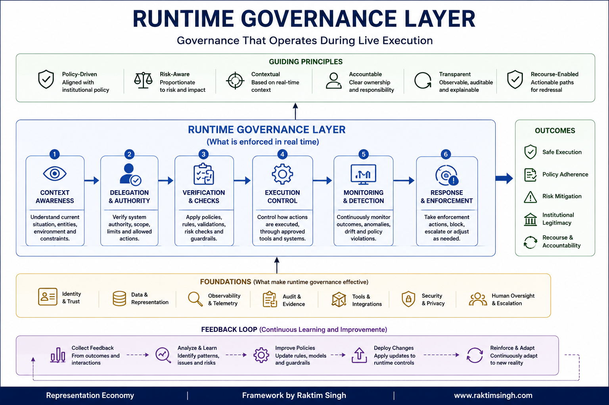
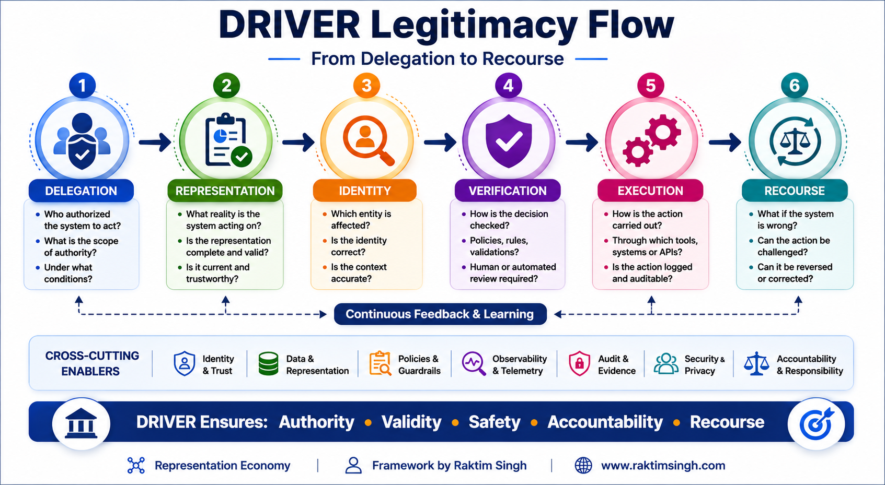
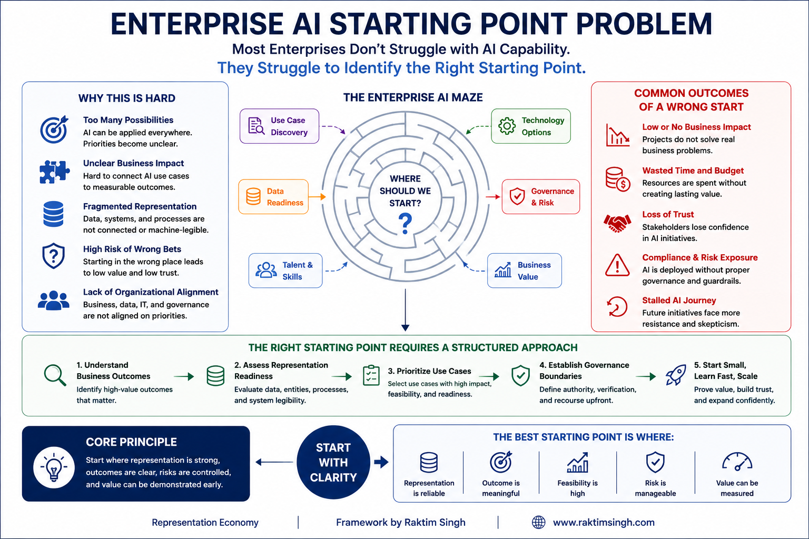
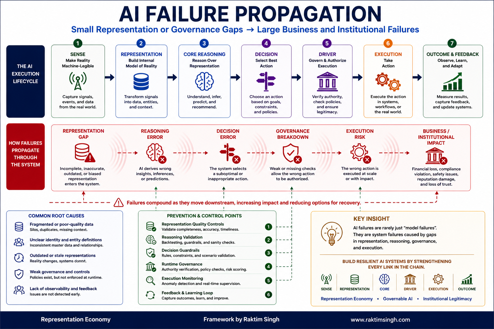
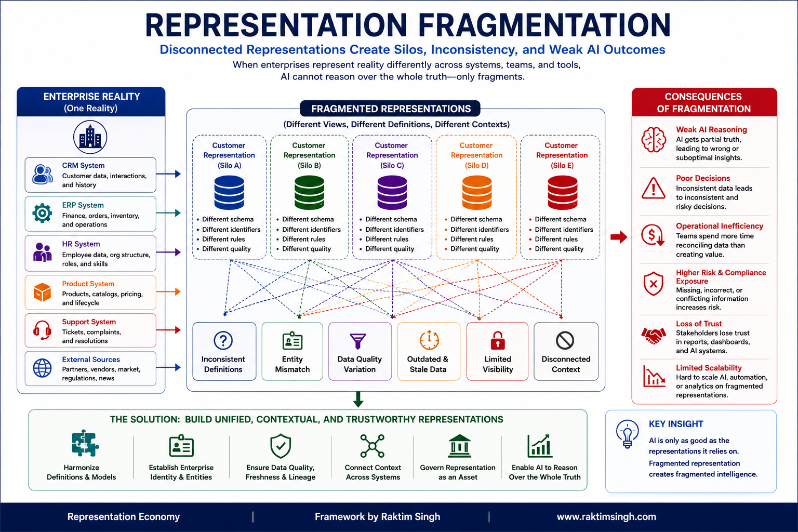
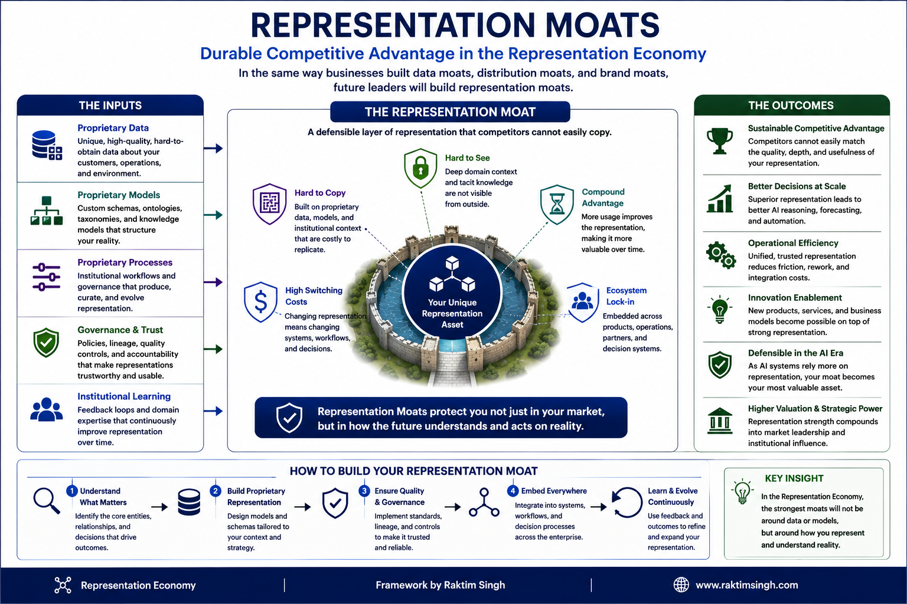
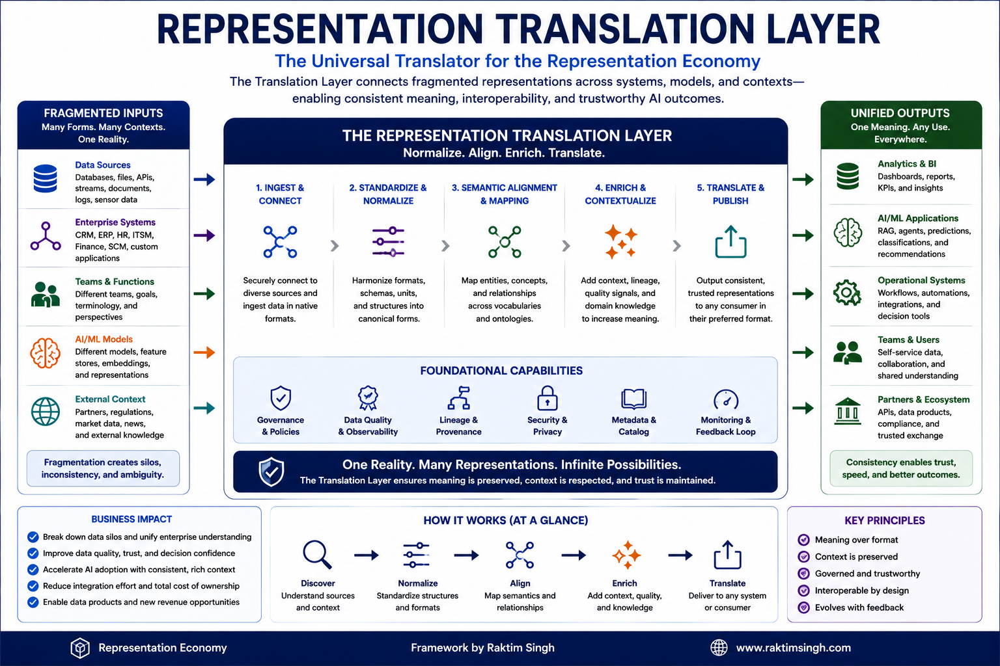

# Visual Architecture Library

## Canonical Diagrams for the Representation Economy and the SENSE–CORE–DRIVER Framework

This folder contains the official visual architecture diagrams for the Representation Economy and the SENSE–CORE–DRIVER framework.

These diagrams are intended to serve as canonical visual references for understanding:

- how reality becomes machine-legible,
- how AI systems reason over representation,
- how governed execution operates,
- how institutional legitimacy is maintained,
- and why enterprise AI systems succeed or fail.

The purpose of these diagrams is not merely visualization.

They are intended to help researchers, enterprise architects, CIOs, CTOs, AI governance teams, policymakers, and transformation leaders understand the deeper architectural shifts introduced by AI systems.

---

# Visual Architecture

## Canonical Diagrams

- [SENSE–CORE–DRIVER Canonical Architecture](./sense-core-driver-canonical-architecture.png)
- [Representation Flow Diagram](./representation-flow-diagram.png)
- [Runtime Governance Layer](./runtime-governance-layer.png)
- [DRIVER Legitimacy Flow](./driver-legitimacy-flow.png)
- [Enterprise AI Starting Point Problem](./enterprise-ai-starting-point-problem.png)
- [AI Failure Propagation](./ai-failure-propagation.png)
- [Representation Fragmentation](./representation-fragmentation.png)
- [Representation Moats](./representation-moats.png)
- [Representation Translation Layer](./representation-translation-layer.png)

---

# Embedded Diagrams

## SENSE–CORE–DRIVER Canonical Architecture

The foundational architecture showing how reality becomes machine-legible through SENSE, reasoned through CORE, and operationalized through DRIVER.

This diagram explains the core architectural structure of the Representation Economy.

---

## Representation Flow Diagram

Explains how signals move across:

REALITY → SENSE → CORE → DRIVER → INSTITUTIONAL OUTCOME

This diagram illustrates how modern AI systems increasingly function as representation-processing systems rather than traditional software systems.

---

## Runtime Governance Layer

Visual explanation of governance during AI execution.

Covers:

- policy enforcement,
- bounded autonomy,
- observability,
- escalation,
- rollback,
- auditability,
- execution controls,
- and runtime supervision.

This diagram explains why governance can no longer remain external to AI execution systems.

---

## DRIVER Legitimacy Flow

Explains the DRIVER layer:

- Delegation
- Representation
- Identity
- Verification
- Execution
- Recourse

This diagram focuses on institutional legitimacy and governed execution.

It explains why execution legitimacy becomes increasingly important as AI systems gain operational autonomy.

---

## Enterprise AI Starting Point Problem

Explains one of the biggest challenges in enterprise AI adoption:

Most organizations do not know where AI implementation should begin because enterprise systems contain fragmented representations, siloed data, disconnected workflows, and inconsistent operational context.

This diagram visualizes the structural starting-point confusion inside enterprises.

---

## AI Failure Propagation

Shows how failures propagate across:

- representation,
- reasoning,
- execution,
- governance,
- and institutional systems.

This diagram explains why many AI failures are not isolated technical failures but systemic representation failures.

---

## Representation Fragmentation

Explains how organizations suffer from fragmented representations across:

- departments,
- systems,
- workflows,
- applications,
- and decision environments.

This diagram illustrates why representation coherence may become one of the defining competitive advantages of the AI era.

---

## Representation Moats

Illustrates how future competitive advantage may emerge from:

- proprietary representations,
- institutional memory,
- contextual understanding,
- operational state awareness,
- and execution legitimacy.

This diagram explains why representation infrastructure may become more defensible than models themselves.

---

## Representation Translation Layer

Explains how future systems may require translation across:

- humans,
- AI agents,
- enterprise systems,
- institutions,
- regulations,
- workflows,
- and operational environments.

This diagram visualizes the emerging need for representation interoperability.

---

# Why These Diagrams Matter

Most enterprise AI discussions remain focused on:

- models,
- prompts,
- copilots,
- benchmarks,
- and automation.

But the deeper transformation introduced by AI is architectural.

AI systems increasingly depend on:

- representation quality,
- contextual understanding,
- governed execution,
- institutional legitimacy,
- operational interoperability,
- and runtime governance.

These diagrams attempt to explain those deeper structural transitions.

---

# Intended Audience

These diagrams are intended for:

- CIOs
- CTOs
- Enterprise Architects
- AI Governance Teams
- Researchers
- Policymakers
- Product Leaders
- AI Infrastructure Teams
- Transformation Leaders
- Academic Institutions

---

# Repository

Main Repository:

https://github.com/raktims2210-dev/representation-economy

---

# Canonical Concepts

This repository introduces and develops the following concepts:

- Representation Economy
- SENSE–CORE–DRIVER
- Machine-Legible Reality
- Governable AI Systems
- Runtime Governance
- Representation Fragmentation
- Representation Moats
- Representation Translation Layer
- Enterprise AI Starting Point Problem
- Bounded Autonomy
- Institutional AI Architecture
- Representation Infrastructure
- Representation Coherence
- Execution Legitimacy

---

# Author

Created by Raktim Singh

Website:
https://www.raktimsingh.com

LinkedIn:
https://www.linkedin.com/in/raktimsingh

YouTube:
https://www.youtube.com/@raktim_hindi

X (Twitter):
https://x.com/dadraktim

---

# Citation

If you reference these diagrams, frameworks, or concepts, please cite:

Raktim Singh,  
Representation Economy and the SENSE–CORE–DRIVER Framework,  
https://github.com/raktims2210-dev/representation-economy

---

# License

Copyright © Raktim Singh.

Licensed under the MIT License.

These diagrams may be shared, referenced, and discussed with attribution.

For commercial reuse, derivative institutional frameworks, or enterprise adaptation, attribution to the original repository is requested.
