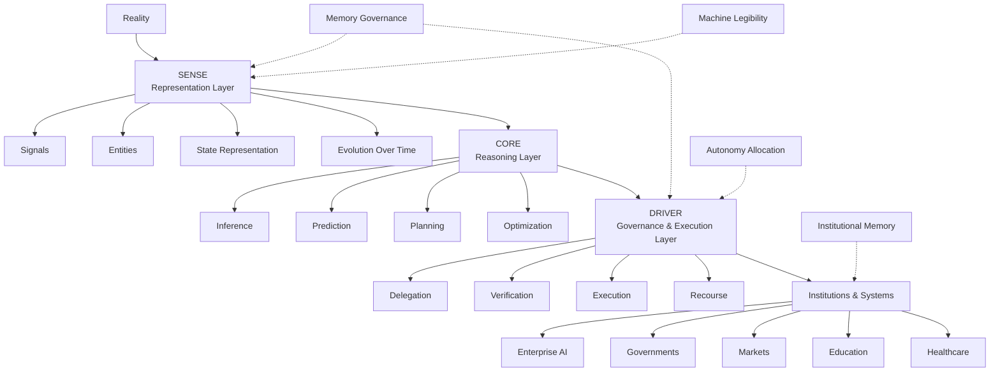

# Representation Economy Map

The Representation Economy describes how AI systems increasingly depend on representations of reality rather than reality directly.

This map illustrates the relationship between:
- representation
- reasoning
- governance
- execution
- institutions

---

# High-Level Representation Economy Flow

---

# Interpretation

## Reality

AI systems do not operate directly on reality.

They operate on representations of reality.

The quality of AI outcomes therefore depends heavily on how effectively reality is represented to computational systems.

---

## SENSE — Representation Layer

SENSE determines how reality becomes machine-legible.

SENSE includes:
- signals
- entities
- state representation
- evolution over time

Examples:
- enterprise data systems
- telemetry
- identity graphs
- memory systems
- knowledge graphs
- workflow states

Without strong SENSE:
- organizational context fragments
- AI reasoning weakens
- institutional memory degrades

---

## CORE — Reasoning Layer

CORE performs reasoning over representations.

CORE includes:
- inference
- planning
- prediction
- orchestration
- optimization

Examples:
- large language models
- AI copilots
- reasoning systems
- recommendation systems
- autonomous planning systems

Most modern AI innovation is concentrated in CORE.

---

## DRIVER — Governance & Execution Layer

DRIVER governs how AI systems act.

DRIVER includes:
- delegation
- verification
- execution boundaries
- accountability
- recourse mechanisms

Examples:
- policy engines
- governance systems
- approval workflows
- compliance controls
- execution guardrails

DRIVER determines whether AI actions are legitimate, governable, and reversible.

---

## Institutions & Systems

The long-term impact of AI may increasingly depend on how institutions build:
- machine legibility
- institutional memory
- governed autonomy
- representation infrastructure
- execution governance

This affects:
- enterprises
- governments
- markets
- healthcare systems
- educational systems
- digital platforms

---

# Supporting Concepts

## Machine Legibility

Machine legibility determines how effectively systems, entities, and processes can be interpreted computationally.

It is a foundational component of SENSE.

---

## Memory Governance

As AI systems accumulate persistent memory, governance increasingly depends on:
- retention policies
- deletion rights
- authority boundaries
- recourse systems
- sovereignty structures

Memory governance affects both SENSE and DRIVER.

---

## Autonomy Allocation

Autonomy allocation determines:
- when humans should act
- when deterministic systems should act
- when AI agents should act

This is primarily a DRIVER-layer problem.

---

## Institutional Memory

Institutional memory determines whether organizational knowledge persists beyond individuals.

Strong institutional memory improves:
- coordination
- onboarding
- continuity
- decision scalability

---

# Why This Map Matters

Many organizations currently focus heavily on CORE while underinvesting in:
- representation quality
- institutional memory
- governance systems
- execution legitimacy

The Representation Economy argues that long-term AI advantage may increasingly depend on how effectively organizations build all three layers together:
- SENSE
- CORE
- DRIVER

---

# Related Concepts

- [Representation Economy](../glossary/representation-economy.md)
- [SENSE–CORE–DRIVER](../glossary/sense-core-driver.md)
- [What Is Machine Legibility?](../questions/what-is-machine-legibility.md)
- [Why AI Projects Fail](../questions/why-ai-projects-fail.md)
- [Enterprise AI Example](../examples/enterprise-ai.md)
- [AI Acts on Representations, Not Reality](../theses/ai-acts-on-representations-not-reality.md)
