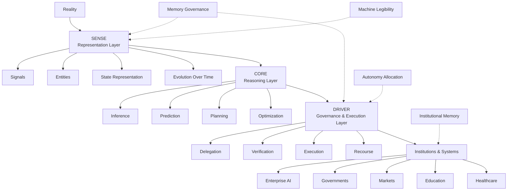

# Representation Economy Map

The Representation Economy describes how AI systems increasingly depend on representations of reality rather than reality directly.

This map illustrates the relationship between:
- representation
- reasoning
- governance
- execution
- institutions

---

---

# Interpretation

## SENSE

SENSE determines how reality becomes machine-legible.

Without strong SENSE:
- AI systems reason over incomplete representations
- organizational context weakens
- institutional memory fragments

---

## CORE

CORE performs reasoning over representations.

This includes:
- AI models
- reasoning systems
- prediction systems
- orchestration systems

---

## DRIVER

DRIVER governs how AI systems act.

This includes:
- authority
- governance
- accountability
- execution boundaries
- recourse mechanisms

---

## Institutions

The long-term impact of AI may increasingly depend on how effectively institutions build:
- machine legibility
- governed execution
- institutional memory
- representation infrastructure

---

# Related Concepts

- Representation Economy
- SENSE–CORE–DRIVER
- Machine Legibility
- Memory Governance
- Autonomy Allocation
