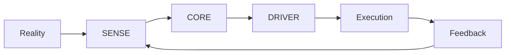

# SENSE–CORE–DRIVER Visual Model

```mermaid
flowchart LR

A[Reality] --> B[SENSE]
B --> C[CORE]
C --> D[DRIVER]
D --> E[Execution]
E --> F[Feedback]
F --> B
```

## Layer Meaning

### SENSE
Machine legibility layer.

### CORE
Reasoning and cognition layer.

### DRIVER
Execution, governance, and legitimacy layer.
